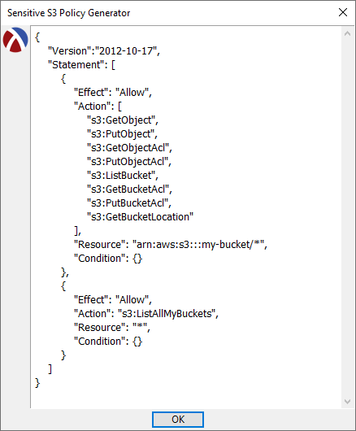

# S3-policy-generator
Generates a per-folder/user S3/Wasabi policy (JSON). 
A 'sensitive' version is also provided, which generates a sensitive sub-user S3/Wasabi policy (JSON).

## Downloads
You can <b>download</b> the latest release for <b>Windows</b> as a portable, standalone executable [HERE](https://github.com/DexterLagan/S3-policy-generator/releases).

## Sample Output

<pre>
{
    "Version":"2012-10-17",
    "Statement": [
        {
            "Effect": "Allow",
            "Action": [
                "s3:GetObject",
                "s3:PutObject",
                "s3:GetObjectAcl",
                "s3:PutObjectAcl",
                "s3:ListBucket",
                "s3:GetBucketAcl",
                "s3:PutBucketAcl",
                "s3:GetBucketLocation"
            ],
            "Resource": "arn:aws:s3:::my-bucket/*",
            "Condition": {}
        },
        {
            "Effect": "Allow",
            "Action": "s3:ListAllMyBuckets",
            "Resource": "*",
            "Condition": {}
        }
    ]
}
</pre>
